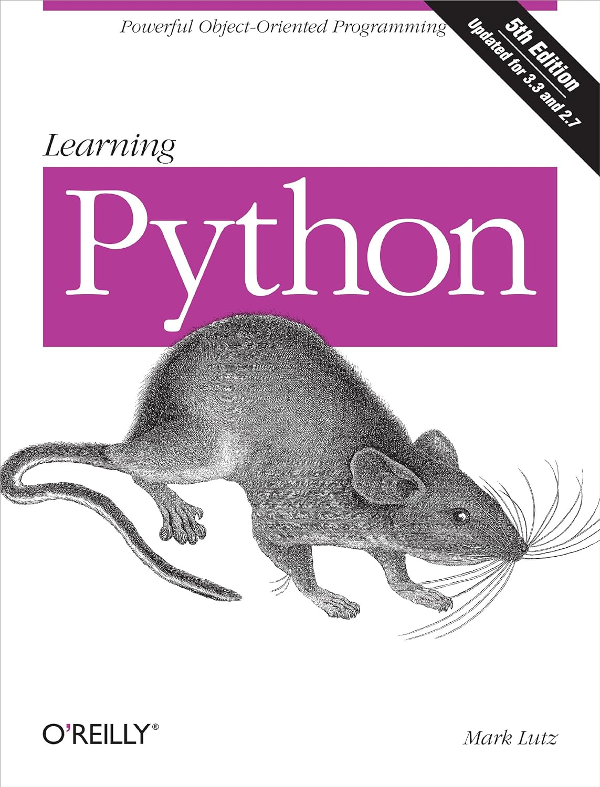

# Learning Python
A repository to help me learn Python. Here are the annotations from books I'm reading and courses I'm taking or took before. Some annotations are in English (en) and other are in Portuguese (pt-br).

## [Aprendendo Python](https://github.com/virginiasatyro/learning-python/tree/master/aprendendo-python-pt-br)

## [Automatize Tarefas Maçantes Com Python](https://github.com/virginiasatyro/learning-python/tree/master/automatize-tarefas-pt-br)

### Sumário

- PARTE I - Básico da programação Python
    - Capítulo 1 - Básico sobre o Python
    - Capítulo 2 - Controle de Fluxo
    - Capítulo 3 - Funções
    - Capítulo 4 - Listas
    - Capítulo 5 - Dicionários e estruturação de dados
    - Capítulo 6 - Manipulação de strings
- PARTE II - Automatizando tarefas
    - Capítulo 7
    - Capítulo 8
    - Capítulo 9
    - Capítulo 10
    - Capítulo 11
    - Capítulo 12
    - Capítulo 13

## [Coursera](#coursera)

https://www.coursera.org/

## Edx

## Matplotlib

## Numpy

## [Pense em Python](https://github.com/virginiasatyro/learning-python/tree/master/pense-em-python-pt-br)

### Sumário

- Prefácio
- 1. A jornada do programa
- 2. Variáveis, expressões e instruções
- 3. Funções
- 4. Estudo de caso: projeto de interface
- 5. Condicionais e recursividade
- 6. Funções com resultado
- 7. Iteração
- 8. Strings
- 9. Estudo de caso: jogos de palavras
- 10. Listas
- 11. Dicionários
- 12. Tuplas
- 13. Estudo de caso: seleção de estrutura de dados
- 14. Arquivos
- 15. Classes e objetos
- 16. Classes e funções
- 17. Classes e métodos
- 18. Herança
- 19. Extra
- Apêndice A: Depuração
- Apêndice B: Análise de algoritmos
- Colofão / Sobre o Autor

### Status

In progress.